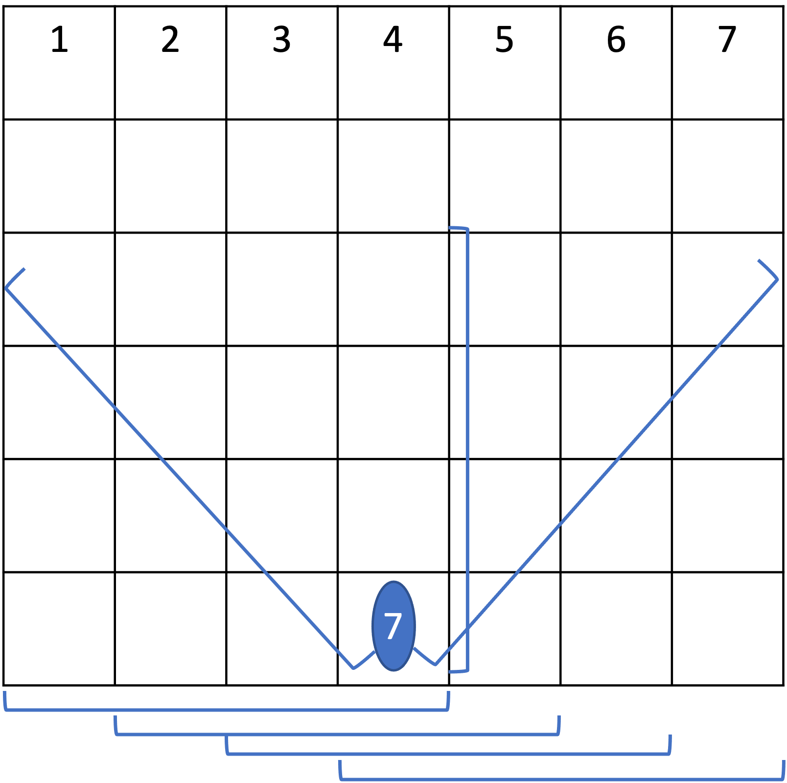

[![Forks][forks-shield]][forks-url]
[![Stargazers][stars-shield]][stars-url]

<h1 align="center">Connect 4</h1>
<p align="center">Program using Game theory (MinMax algorithm) on Connect4, try to beat it if you dare 🤓 </p>
<div align="center">

</div>

## Environment 🌎
  Our Connect 4 game is using the mainstream rules of a Connect 4, this is a two players games where each player can place one coin in the column of their choice in turn. The goal is to **align four** of your coins along the **horizontal axis**, **the vertical axis** or on **any diagonal** of the grid. The little twist of our project is that it is **adaptable to any grid size** with the constraint of the number of columns and lines being at least 4.

<div align="center">

</div>

This projet was realized for the 1st year course **"Introduction to AI and data science"** of *Ecole Superieur Léonard de Vinci (ESILV)*.

## Implementation 🧠
**AI Rules**

Possible actions : $A = \{1,2, ..., n_{columns}\}$

Rewards : **Win** = + 1000 - depth ; **Loss** = - 1000 + depth

**MinMax algorithm**

  The MinMax algorithm is well know in **Game theory**, to describe it rapidly we can stick it to the Connect 4 which is a sequential game meaning that at each step (the player plays a coin) there is a new state. Hence, the goal of the minmax algorithm is simply to find the move that will **maximize your possible reward and next step maximize the possible reward of the oppenent** (So minimize yours). To do so, it will iterate threw all your possible actions and go on on multiple steps that we wll call depth until reaching eather a final reward or a maximum depth.
To optimize the algorithm, we also use the alpha beta pruning method to stop predicting for actions that are considered too bad.
To know more about minimax algorithm and alpha beta pruning don't hesitate to check this <a href= https://medium.com/swlh/optimizing-decision-making-with-the-minimax-ai-algorithm-69cce500c6d6>article</a>.

**Heuristic**

As the board can provide too many possibilities of actions, the time complexity for the MiniMax algorithm is too high and we are forced to use an **heuristic**. An heuristic is simply a score that you give to a given state of the game, this is what the minimax will compute after diving on a defined depth. We chose quite a simple to compute heuristic a we use an evaluation grid which is fixed at the begining of the game and depends on the size of the grid. Each cell is assigned a value which corresponds to the number of possible alignments it is oppened to, for exemple :

<div align="center">

</div>

Since there are 7 possible alignment, this cell takes the value 7 etc. You can easily see that that it looks like Gaussian joint probability distribution, this is on this realisation that we could easily adapt the code to any shape of Connect 4, hence our heuristic is simply created with gaussian densities.

**Depth**

We chose to let the AI see only 3 step forward to limit the computational time to maximum 10 seconds, however moving forward in the game the maximum depth slowly increases to 8. 

## Quick Start 💻 (Python3)

### Installation

You can follow the different steps inorder to get the programm working on your computer


1. Clone the repo
   ```sh
   git clone https://github.com/chloedia/Connect4.git
   ```
3. Execute the python script
   ```sh
   #Default board size (6,12)
   python3 main.py
   #Custom board size)
   python3 main.py --board_size 6 12
   #Let the AI play alone
   python3 main.py --board_size 6 12 --iaVSia True
   ```

  
  

The board should appear! The interface is pretty intuitive, try to beat my AI now 🤓

<p align="right"><a href="#readme-top">🔝</a></p>

<!-- CONTACT -->
-----
</br>

[![LinkedIn][linkedin-shield]][linkedin-url]
</br>
Chloé Daems - chloedaems0@gmail.com


<!-- MARKDOWN LINKS & IMAGES -->
[forks-shield]: https://img.shields.io/github/forks/VictorGoubet/ConnectUltra.svg?style=for-the-badge
[forks-url]: https://github.com/VictorGoubet/ConnectUltra/network/members
[stars-shield]: https://img.shields.io/github/stars/VictorGoubet/ConnectUltra.svg?style=for-the-badge
[stars-url]: https://img.shields.io/github/issues/VictorGoubet/ConnectUltra/stargazers
[linkedin-shield]: https://img.shields.io/badge/-LinkedIn-black.svg?style=for-the-badge&logo=linkedin&colorB=555
[linkedin-url]: https://www.linkedin.com/in/chloe-daems/


